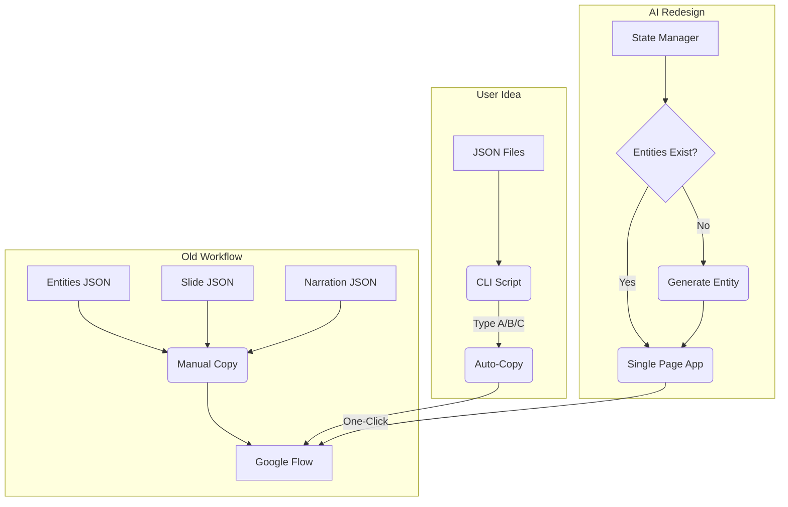

# Don't Just Ask 'How', Ask 'What If': Letting AI Rethink Your Workflows

I recently embarked on a project to generate comics. The core of my workflow involved managing three separate JSON files: one for generating entities, one for the comic slides, and one for the final narration.

Initially, my biggest challenge was purely logistical: highlighting and copy-pasting prompts from these three JSON files into Google Flow was tedious and error-prone.

## The First Idea: A Faster Horse

Because I am a touch typist, my initial solution was to build a simple shell-based experience. I imagined a CLI menu where I could just press `A`, `B`, or `C` to browse directories and copy the contents without ever touching the mouse.

It was a classic "faster horse" solution. I had identified the immediate friction—copy-pasting—and designed a tool specifically to bypass it.

But before writing the script, I decided to pose the problem to an LLM. I dumped my entire workflow into the prompt, explained what I was trying to achieve, and asked: *"How can I streamline this? Imagine you are an expert at using Google Flow."*

## The AI's Redesign: A Paradigm Shift

The LLM *did* address my copy-paste problem, but not with a CLI. Instead, it proposed an entirely different approach that I hadn't even considered:

### 1. The Aggregated View
Instead of hopping between three different JSON files, the LLM suggested creating a single-page web UI. All the components related to a particular chapter and slide would be available in one place. Copying the text became a single click.

### 2. Intelligent State Management
The second proposal was even more impactful. The LLM pointed out that the entities used in my prompts were reusable. Why should I manually keep track of which entities had already been generated?

The new mini-app would maintain this state automatically. It would only prompt me to generate a new entity if it was missing, directly skipping to the image generation prompt if all entities were already present.

## The Takeaway: Brainstorm, Don't Just Delegate

This experience was a revelation. Because I had never executed that specific workflow at scale, I couldn't see the structural inefficiencies; I only saw the immediate pain points.

**It’s like trying to process complex math by learning to move the beads on an abacus faster. You might ask an expert for better finger techniques. But a modern expert would just hand you a calculator. You were focused on tracking the manual state yourself, while the AI suggested letting a system handle the computation entirely.**

When you are exploring a new field or building a novel process, don't just ask the AI *how* to build your preconceived solution. Instead, explain your ultimate goal and brainstorm with it. LLMs have ingested countless examples of what others have tried across various industries. You can leverage that collective knowledge upfront to leapfrog iterative improvements and land on a fundamentally better design.

Thanks to this AI-assisted redesign, I'm able to generate comics much faster than my original mouse-heavy workflow, and significantly faster than my proposed shell script would have allowed.
