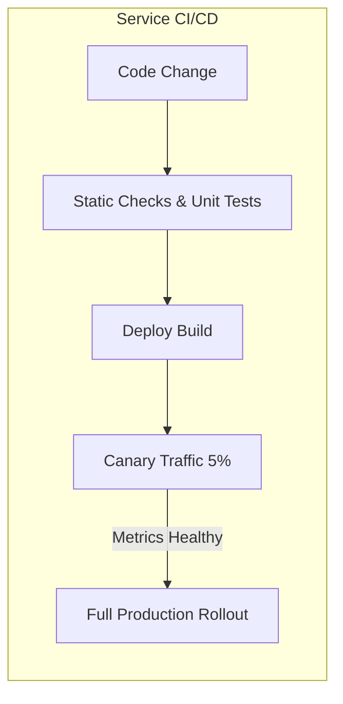
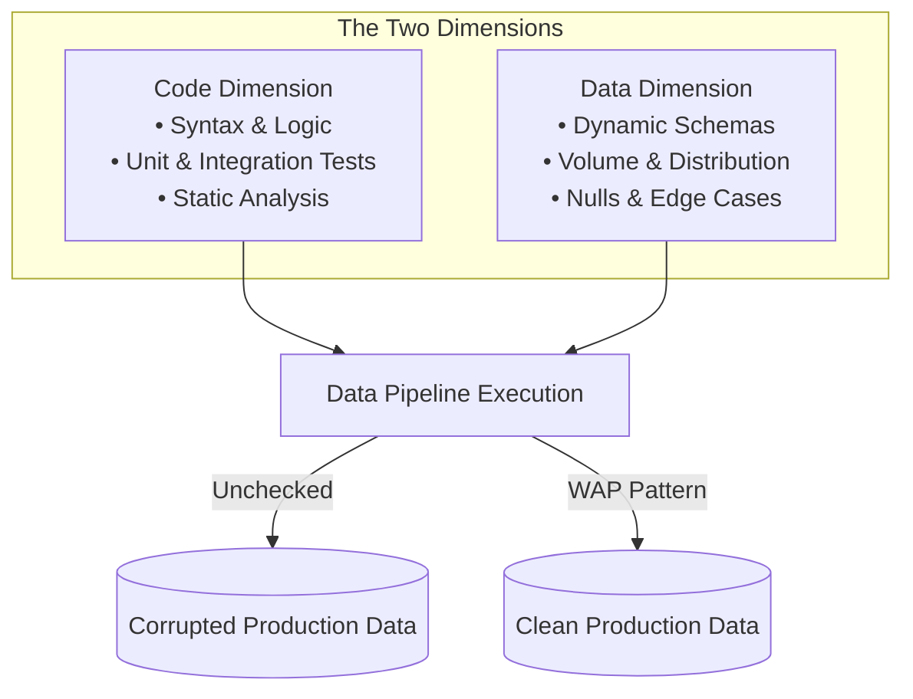
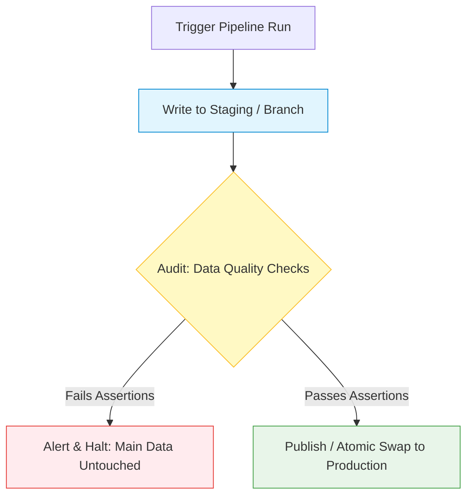

# The Missing Dimension: Why Data Pipeline CI/CD Needs More Than Just Code

We recently invested in streamlining change management for our data pipelines. On paper, our CI/CD setup did everything right: code was version-controlled, static checks and linters ran at build time, and automated deployment pipelines shipped changes across our data platforms without manual intervention.

Yet, despite having zero build failures and clean deployments, we realized a critical truth:

> **A successful code deployment does not guarantee a safe data release.**

This sparked an exploration into how software services handle change management, and why simply copying traditional software engineering practices into data engineering leaves a massive blind spot.

---

## The 1D World of Microservices: Code and Traffic

In traditional backend services, change management primarily revolves around **Code**. 

When software engineers test an API service, they can:
1. **Mock dependencies:** Database calls, cache lookups, and third-party APIs can be simulated in unit and integration tests.
2. **Guarantee determinism:** Given input $X$, the service will reliably return output $Y$.
3. **Control rollouts:** Using canary releases or blue-green deployments, engineers can route 5% of user traffic to the new build, monitor error rates and latency, and quickly rollback if an anomaly occurs.

The service deployment model operates in a world where the application logic dictates the behavior, and runtime inputs generally adhere to strict API contracts.

---

## The 2D World of Data Pipelines: Code + Data

When you move from software services to data pipelines, you enter a two-dimensional problem space. You aren't just deploying logic—you are deploying logic that acts upon massive, evolving datasets.

### The Water Treatment Facility Analogy

Think of traditional software CI/CD like certifying the mechanical plumbing of a municipal water treatment plant. You can inspect every pump, check pipe pressure tolerances, and confirm every valve turns smoothly (the **code**).

However, the water entering the plant comes from a natural river (the **data**). One day it’s clear; the next day heavy rain brings mud, agricultural runoff, or mineral spikes. 

If the river changes, flawless plumbing won't prevent contaminated water from reaching homes if the treatment recipe wasn't designed for that specific turbidity. 

You cannot simply certify the facility once at install time and assume every drop delivered will be potable. You need:
1. **Inline testing and sample ports** measuring the water continuously as it flows.
2. **A holding reservoir** where treated water is audited *before* opening the valves to the main municipal supply.

---

## Why Local Mocks Fall Short in Data

In data pipelines, code can be completely bug-free according to every unit test, yet still produce catastrophic downstream failures in production. Why?

- **Real Data Cannot Be Fully Mocked:** Synthetic datasets rarely capture the messy quirks of production: subtle null spikes, distribution drift, unexpected string encodings, or out-of-order event streams.
- **State and Irreversibility:** If a faulty pipeline writes bad data into a shared production warehouse, rolling back the code doesn't fix the corrupted tables. You now face painful backfills, downstream report invalidation, and broken customer trust.
- **Dynamic Inputs:** Even if your code hasn't changed in months, an upstream source altering its business logic can break your pipeline overnight.

---

## Safe Change Management: The Write-Audit-Publish (WAP) Pattern

To bring true safety to data pipelines, we need deployment strategies that validate both code logic and the resulting data output before it reaches consumers.

One of the most effective patterns for this is **Write-Audit-Publish (WAP)**.

### 1. Write (Stage)
Instead of writing transformations directly into production tables, the pipeline writes output to an isolated staging area, temporary partition, or table branch (e.g., using Iceberg/Delta lake branching).

### 2. Audit (Validate Expectations)
Before making the data visible to downstream queries, an automated suite of assertions evaluates the staged data:
- **Completeness:** Are primary keys unique and non-null?
- **Volume & Anomaly:** Is the row count within expected standard deviations?
- **Schema & Types:** Have any columns changed type or disappeared?
- **Business Logic:** Do aggregated metrics (e.g., daily revenue, conversion rates) fall within rational bounds?

### 3. Publish (Atomic Promotion)
If and only if all audit checks pass, the staged data is atomically swapped or merged into the production table. If any assertion fails, the publish step is blocked, an alert is triggered, and production remains unpolluted.

---

## Continuous Assertions: Quality as a Runtime Feature

In standard software, integration tests run during build time. But in data pipelines, because data is dynamic and changes with every run, **data quality checks must run continuously in production**.

| Dimension | Microservice CI/CD | Data Pipeline Change Management |
| :--- | :--- | :--- |
| **Primary Focus** | Code correctness & traffic handling | Code logic + Data characteristics |
| **Testing Scope** | Static analysis, mocked unit tests | Build-time tests + Runtime data assertions |
| **Rollout Strategy** | Canary deployments / Blue-green traffic | Write-Audit-Publish (WAP) / Partition staging |
| **Failure Impact** | Transient errors / request drops | Persistent table corruption / expensive backfills |
| **Continuous Checks**| APM, latency, error logs | Schema validation, distribution checks, freshness |

---

## Summary: Elevating Data Pipeline Maturity

Streamlining CI/CD for data pipelines is a great first step, but code deployment is only half the battle. True change management in data engineering requires acknowledging the dynamic, living nature of data.

By pairing traditional code CI/CD with data-aware patterns like **Write-Audit-Publish** and **continuous in-run assertions**, we move from simply releasing code quickly to releasing trustworthy data safely.
