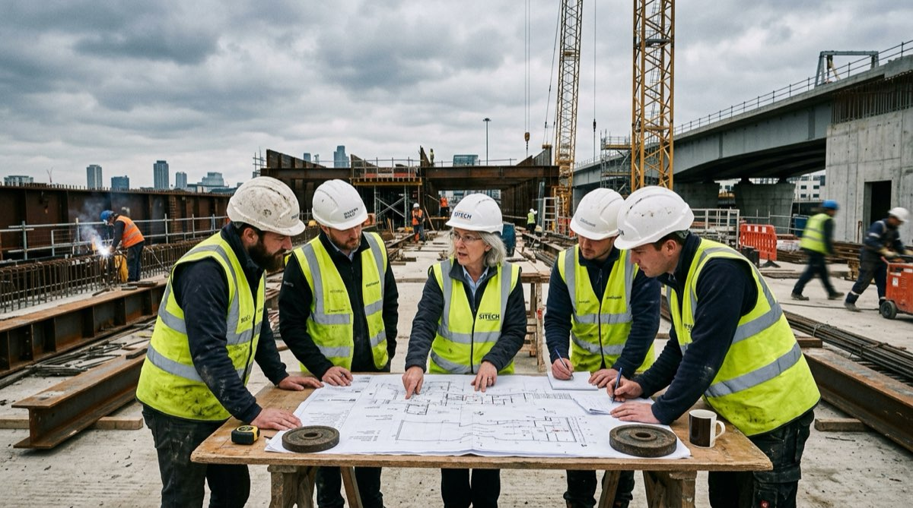
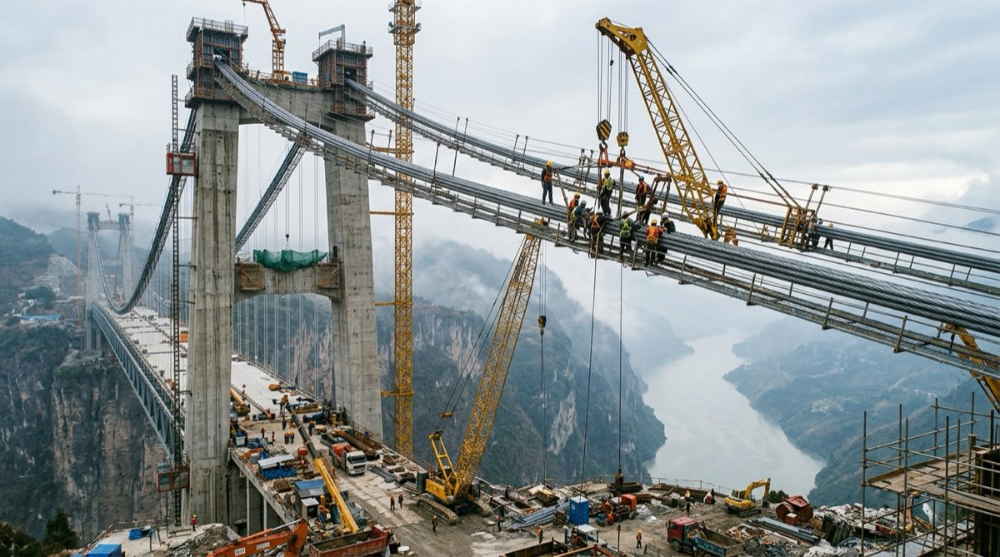
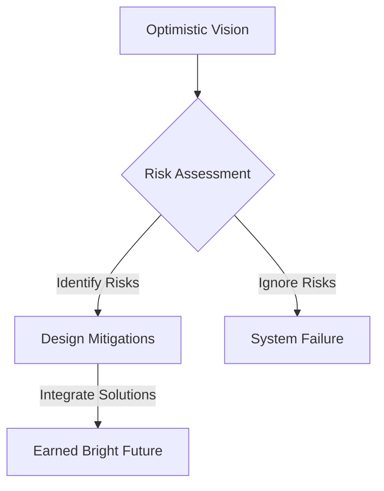

# Earning the Bright Future: Why We Can't Leave Tomorrow to Chance

> Takeaway: A dependable future is never an accident; builders must actively mitigate foreseeable hazards to earn reliable outcomes.

*Caption: Engineering teams review structural blueprints on site to mitigate critical project risks.*

The growth of Artificial Intelligence (AI) looks promising to researchers and builders alike. However, lasting success is never guaranteed without deliberate preparation. We cannot rely on good intentions alone; building a dependable future requires us to test our assumptions with care.

## The Quote That Resonated

I recently read [*The Worlds I See: Curiosity, Exploration, and Discovery at the Dawn of AI* (search)](https://www.amazon.com/s?k=The+Worlds+I+See+Fei-Fei+Li) by Dr. Fei-Fei Li. During her preparations to testify before Congress in 2018, she reflected on the responsibilities surrounding AI development. Facing a room filled with public concerns, she summarized her guiding philosophy:

> "I have always been optimistic about the power of science, and I remain so. But the tumultuous years leading up to the day had taught me that fruits of optimism aren't taken for granted. While the future might be bright, it won't so be by accident. We have to earn it together."
-- Dr. Fei-Fei Li, The Worlds I See

## Why We Focus on Risks

Reading this passage sparked an immediate connection to my daily engineering work. When I review our modern development workflows, I recognize several clear parallels.

Analogy (Civil Engineering): Bridge builders calculate wind shear and material fatigue before pouring asphalt on a suspension deck.

Engineers do not merely paint an attractive picture of cars crossing a gorge. They install structural dampers and inspect steel joints to survive heavy storms.

The bridge stands because its creators anticipated points of failure early. Looking at our software workflows, I see that same discipline across shared organizational checkpoints:

- Architecture proposal templates mandate explicit risk sections to force teams beyond optimistic timelines.
- Peer code reviews scrutinize edge cases and failure modes to derisk changes before merging.
- Project pre-mortem exercises prompt teams to confront potential project failures before writing software.
- Production Readiness Reviews (PRRs) evaluate operational runbooks and monitoring coverage before launch.
- Blameless post-mortems convert production incidents into prioritized remediation tickets with tracked completion dates.
- Architectural threat modeling sessions identify privilege risks and data tampering paths during technical design.
- Write-Audit-Publish (WAP) pipelines validate data assertions in staging before swapping production tables.
- Canary deployment pipelines route small traffic slices and trigger automatic rollbacks when errors spike.
- Chaos experiments intentionally terminate primary database instances in staging to verify failover automation.

I now view these engineering practices through a completely different lens. They do not exist to slow builders down during delivery. Instead, these guardrails ensure that the future we engineer is genuinely safe and dependable.

## The Path to an Earned Future

Translating optimism into production software requires structured verification:

## What to do next

Audit your current project proposals for unaddressed operational risks.
Write down specific mitigation steps for each identified vulnerability before writing code.
Share those contingency plans with your stakeholders to confirm alignment.

<!-- unverified links: https://www.amazon.com/s?k=The+Worlds+I+See+Fei-Fei+Li -->
