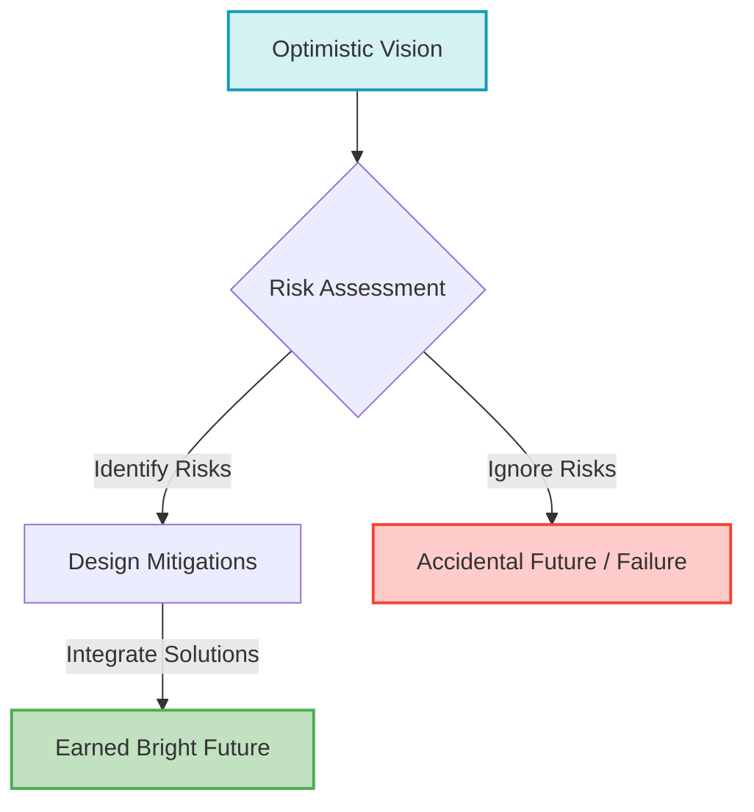

# Earning the Bright Future: Why We Can't Leave Tomorrow to Chance

The future of technology, especially in fields like artificial intelligence, looks incredibly promising. But a bright future isn't a guarantee—it's an intentional effort.

## The Quote That Resonated

I am currently reading [*The Worlds I See: Curiosity, Exploration, and Discovery at the Dawn of AI*](https://www.amazon.com/dp/1250897939) by Dr. Fei-Fei Li. In the book, she recounts her experience preparing to testify before the House Committee on Science, Space, and Technology in 2018 on the topic of artificial intelligence. 

Facing a room filled with valid concerns and looming risks about AI, her guiding mental model and inner reflection leading up to that day was captured perfectly:

> "I have always been optimistic about the power of science, and I remain so. But the tumultuous years leading up to the day had taught me that fruits of optimism aren't taken for granted. While the future might be bright, it won't so be by accident. We have to earn it together."

## Why We Focus on Risks

This quote resonated deeply with me. It perfectly encapsulates why we work the way we do.

When we write docs, draft proposals, or design new systems, it's easy to get swept up in the excitement of what we are building. It is easy to just focus on the "happy path" and forget about what could go wrong. 

This is precisely why we always dedicate significant sections in our work to **risks and how we are going to mitigate them**. We don't do this out of pessimism; we do it because a successful outcome isn't something we can just assume will happen.

## An Analogy: Engineering Optimism

Think about building a massive suspension bridge across a treacherous gap. 

The engineers don't just draft a beautiful picture of cars driving smoothly across it at sunset. They spend the vast majority of their time calculating wind resistance, load-bearing capacities, and material fatigue. They install protective measures against storms and shifting ground.

The bridge doesn't stand by accident. It stands because the engineers anticipated every way it could fail and built mitigations directly into the design. They *earned* the safety and success of the bridge by actively navigating the risks.

## The Path to an Earned Future

Here is how our optimistic vision translates into actionable reality:

The future might be bright, but it won't be by accident. We have to build it like that. By acknowledging risks and actively mitigating them, we are doing the hard, necessary work to turn our optimism into reality.
