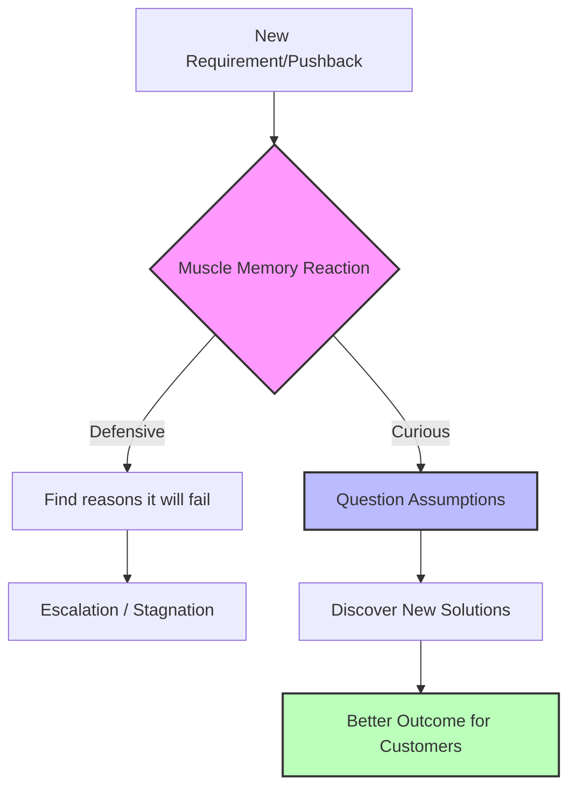

When we're trying to drive an initiative forward, pushback often feels like a roadblock. It’s frustrating. It slows down momentum. But what if pushback is actually the best thing that could happen to your project? 

Recently, we were working to get approval for a wide ticket campaign to implement some change management in our data. As we sought approval, we were hit with a sudden requirement: *“We need to build AI-related automation to simplify this for downstream customers.”*

### The Muscle Memory Reaction

Our immediate reaction was defensive. This process had *always* been handled manually by customers. 

We immediately rattled off all the reasons why automation would fail and why it wouldn't be effective in this scenario. This is a classic example of **muscle memory**. When you do something the same way for a long time, any suggestion to change it is met with automatic, deeply ingrained resistance. 

But the stakeholders pushed back again. *“No, it is possible,”* they said, and they shared a tangible example.

At this point, we had a choice. We internally debated escalating the issue to bypass the requirement. But before going down that route, we decided to pause and genuinely ask ourselves: *Is there anything we can actually do here?*

### The Pivot 

When we finally dedicated focused time to the problem, stepping away from our preconceived notions, we realized they were right. 

We discovered that we could build partial automation using keyword searches and AI agents to help customers. Would it be perfect? No. There would be false positives. But it would give customers a massive head start. More importantly, this automation might even help them identify impacted assets they would have completely missed if they were doing it manually. 

### The Detour Sign Analogy

Think about your daily commute. You take the exact same route to work every single day without thinking. That’s your muscle memory. 

One day, you encounter a "Road Closed" sign. Your initial reaction is annoyance. You might even try to find a reason why the sign is wrong or look for a sneaky way around it. But eventually, you are forced to take a detour. 

And sometimes, on that detour, you discover a new route that is actually faster, avoids the worst traffic lights, or is simply a much more pleasant drive. 

Pushback in our professional lives is exactly like that detour sign. It forces us off our well-worn path. 

### The Lesson

In this instance, the pushback for automation was unequivocally good. 

My biggest takeaway is that **pushbacks should be taken as an opportunity to question our assumptions and ways of working.** Often, our assumptions become so ingrained in our muscle memory that they become the default response, and we rarely stop to question them.

Moving forward, my goal is to use every piece of pushback as a trigger to ask: *Which of my assumptions needs to be revisited?* By doing so, we turn roadblocks into launchpads for better, more innovative solutions.
