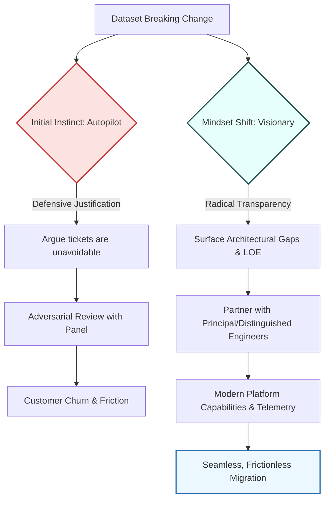

When you need to roll out breaking changes to a core dataset, the default playbook in many software organizations feels routine: create a blanket ticket campaign, blast them out to every downstream customer team, and track their migration progress before releasing the change to production.

Recently, my team was gearing up to do just that. But before we could hit "send," our campaign had to pass through an engineering review panel staffed by Senior Principal and Distinguished Engineers. 

Their mandate was clear: **protect downstream teams from unnecessary churn and prevent the ticketing system from being weaponized as a substitute for thoughtful engineering.**

When they pushed back on our campaign, our immediate instinct was classic defensive justification. Our systems were built this way. Rebuilding the underlying pipeline would be exorbitantly costly. Surely, in this specific case, sending a mass batch of tickets was the only realistic path forward.

Then, a podcast insight completely upended how I viewed the entire problem.

---

### The Catalyst: Resources Are a Conversation Away

Shortly after that meeting, I watched an interview on [*The Diary Of A CEO* with entrepreneur Daniel Priestley](https://www.youtube.com/watch?v=u0o3IlsEQbI&t=1766s). During the conversation, Priestley shared a perspective that immediately reframed my situation:

> *"The visionary has a different view of life. And the first thing is that if a resource exists on the planet anywhere, that resource is really just a couple of conversations away... Someone woke up this morning with the resource that you want. And if you have a conversation about how that resource gets used, essentially, it's as good as you having the resource."*

Priestley illustrated this with the production of the original *Top Gun*. The filmmakers initially tried to figure out how to build intricate, expensive miniature scale models of aircraft carriers and fighter jets. Finally, someone asked a simple question: *“Have we called the Navy?”* 

When they called, they discovered the Navy had a massive recruitment goal. By aligning their needs, the Navy gladly provided real fighter jets and aircraft carriers for the film.

Priestley contrasted three mental states:
1. **Reptile Mode:** Reactive, fearful, and defensive—often fighting against the very people offering guidance.
2. **Autopilot Mode:** Resigned to the status quo (*"This is how we've always operated; it's too difficult to change"*).
3. **Visionary Mode:** Stepping back to ask: *"What could we do differently? Who already has the resources to help us solve this?"*

In that review meeting, I had been firmly stuck in Autopilot, teetering on Reptile. I was defending the limitations of our past architecture rather than examining the opportunity right in front of me.

---

### The Transit Detour vs. The Parallel Tunnel

Think of it like civil infrastructure in a growing city. 

Imagine a municipal water crew that needs to upgrade a main pipe beneath a busy boulevard. The quickest option for the water crew is to drop concrete barricades across fifty private driveways, handing each homeowner a flyer telling them to find their own detour for the next three weeks. 

When the city traffic commission steps in and denies the permit because it will gridlock the neighborhood, the water crew’s knee-jerk reaction is to argue: *"We have to fix the pipe! How else are we supposed to do it?"*

A smarter crew looks across the median. The regional transit authority is already boring a parallel utility conduit two blocks over. Instead of forcing fifty neighbors to navigate around road cones, the crew strikes up a conversation with the transit engineers, taps into the shared conduit, and finishes the upgrade without a single commuter noticing.

The resources already exist. You just have to stop looking at the review panel as an obstacle and start looking at them as people with the map to the conduit.

---

### Rethinking the Architecture: Beyond the Ticket

Instead of asking, *"How do we justify this ticket campaign?"* the question became: **"What would it take to eliminate the need for ticketing altogether?"**

When we stripped away the assumption that customers *must* manually update their code on our timeline, several foundational capabilities became obvious:

1. **Multi-Version Dataset Coexistence:** Rather than forcing a hard cutover, develop practices that allow multiple schema versions of a dataset to remain active concurrently. Customers can migrate at their natural release cadence rather than under artificial pressure.
2. **Automated Telemetry-Based Tracking:** Instead of relying on human beings to click "Done" on a Jira ticket, leverage query access logs, lineage graphs, and pipeline telemetry to observe customer migration in real time. We know who has migrated when their queries hit the new endpoints.
3. **Continuous, Library-Style Rollouts:** Software teams don't send individual tickets to every developer when a foundational library updates; they publish versions, leverage automated dependency tools, and use canary rollouts. Data engineering should operate with the same platform maturity.

---

### The Radical Transparency Proposal: A Four-Way Win

Fixing these gaps is not trivial—it requires substantial engineering effort. But that is precisely why the review panel was the best place to have this conversation.

Principal and Distinguished Engineers sit at an organizational altitude where they see across silos. They don't just care about one team's ticket batch; they care about eliminating systemic churn across dozens of teams who face this exact problem every quarter.

By walking in with **radical transparency**—acknowledging the gaps in our current dataset infrastructure and quantifying the level of effort required—we transformed a contentious gate into a strategic partnership.

| Stakeholder | What They Gain |
| :--- | :--- |
| **Individual Contributor** | Stepping into company-wide scope across data engineering and analytics; demonstrating staff-level leadership and promo readiness. |
| **Engineering Manager** | Demonstrating cross-organizational influence, high-leverage delivery, and expanding team impact. |
| **Principal / Distinguished Engineers** | Fulfilling their core charter: eradicating developer toil and raising architectural standards across the company instead of playing ticket police. |
| **Downstream Customer Teams** | Zero ticket clutter, zero forced migrations, and predictable, versioned data contracts. |

---

### Final Thoughts

The next time you face stiff pushback from an architecture board or an approval panel, resist the urge to enter Reptile Mode. You don't need to defend why your system is flawed, and you don't need to fight the people pointing it out.

The people reviewing your work often possess the exact leverage, sponsorship, and platform resources needed to solve the root problem. You only need to have the conversation, understand what problem they are trying to solve, and work together to build a path that leaves everyone better off.
