Corporate cloud accounts insulate engineers from unit economics. At work, enterprise pools cover API bills while team priority stays locked on shipping features. When token usage hides inside a monthly aggregate invoice, a loop that burns millions of tokens reviewing and re-rendering images rarely registers as a defect.

Building personal projects with your own API key changes that immediately. Even on budget-friendly models like Flash or contributor tiers, real telemetry stares back at you. You see every wasted penny, every redundant vision call, and every context leak.

While building an automated comic generation pipeline for the Ramayana, I watched the orchestrator and critic loops burn 45 million tokens on a single 20-panel production run. The surprise: text generation was not the primary driver. The massive token burn came from the **art review and re-render loop**.

By isolating the critic loop, forcing vision evaluations onto 768px thumbnails, and gating image calls behind zero-dollar deterministic checks, total token burn dropped to 12 million tokens on an equivalent 20-panel run (a 72.8% reduction).

Here is how the multimodal review loop leaked tokens, and the exact architectural gates that plugged the leaks.

---

### The Task: The Art Critique and Re-render Loop

The pipeline produces finished comic panels from narrative scripts. Once an initial panel render completes, the pipeline must verify:

1. Character consistency (facial features, attire, accessories).
2. Composition and framing (camera angles, focal points, aspect ratios).
3. Artifact detection (extra limbs, distorted hands, unwanted borders).
4. Text safety and prompt fidelity.

In early runs, the parent orchestrator handled both image generation and visual critique in a single continuous thread. It ingested raw renders, asked a vision model for critique, instructed the generator to revise based on feedback, and repeated the cycle until the panel passed.

That loop produced quality panels, but it created a massive token drain.

---

### The Kitchen Pass Analogy

Think of an expeditor running the pass during dinner service at a busy restaurant.

In a well-run kitchen, when a plate comes off the line, the expeditor takes a small tasting spoon to check the seasoning, wipes a stray drop of sauce off the rim with a clean side towel, and sends the dish to the dining room. Fast, zero waste, and minimal fuss.

The unoptimized critic loop ran like a kitchen in total chaos:

1. **Piling dirty pans on the pass:** To inspect plate number twelve, the expeditor demanded that the line cooks bring out every greasy skillet, vegetable peel, and burnt scrap from the first eleven plates and stack them directly onto the prep table. The counter choked on its own clutter, slowing down every movement.
2. **Plating a banquet to test the salt:** Instead of tasting a single drop with a spoon, the kitchen plated a massive four-course family feast every time they needed to check if the sauce needed salt.
3. **Throwing out the entree for a smudge:** When a drop of jus splashed onto the white ceramic rim, nobody wiped it with a towel. The kitchen dumped the entire prime rib into the trash, fired up a new burner, and cooked the whole dish from raw ingredients all over again.

Running that routine across 20 plates destroyed the kitchen's supply budget and ground service to a halt.

---

### How the Critic Loop Leaked Tokens

Teardown of the execution logs revealed four compounding leaks:

1. **Full-Resolution Image Ingestion:** Raw renders (1536px+) were sent directly to the vision endpoint. Multimodal models tile high-resolution images into hundreds of vision tokens per call.
2. **Parent Context Contamination:** The parent orchestrator retained every high-resolution image in its conversation history. On turn 30, the model was still carrying the pixel token weight of panels approved on turn 2.
3. **Paying API Rates for Deterministic Flaws:** The pipeline paid for expensive image renders and multimodal critiques only to reject images for obvious formatting flaws: bad aspect ratios, forbidden keywords, or solid white border mattes.
4. **Unbounded Generation Spirals:** The review loop generated two candidates per round, evaluated both, and ran open-ended retry cycles without hard stopping conditions.

---

### The Eight Architectural Gates

To solve the leak, we completely decoupled the art critic loop from the parent orchestrator and introduced zero-dollar deterministic gates.

```mermaid
flowchart TD
    subgraph Old["Unoptimized Loop (45M Tokens)"]
        A[Parent Chat Session] --> B[Render 2 Candidates]
        B --> C[Ingest 1536px+ Full-Res]
        C --> D[Vision Model Evaluates]
        D --> E[Parent Context Retains All Images]
        E --> F[Unbounded Retries & Re-renders]
    end

    subgraph New["Gated Critic Pipeline (12M Tokens)"]
        G[Parent Orchestrator: 0 Image Bytes] --> H["$0 Prescan & Pre-trim Gates"]
        H -->|Pass| I["Single-Candidate Render (Count=1)"]
        I --> J["$0 Frame Gate: Deterministic Crop"]
        J --> K["Generate 768px Thumbnail"]
        K --> L["Ephemeral Worker: Minimal Packet"]
        L --> M["Return PASS / FAIL (Max 3 Rounds)"]
        M --> G
    end
```

The specific changes implemented across the pipeline:

#### 1. 768px Thumbnails Only; Parent Sees Zero Image Bytes
The parent orchestrator context now carries **zero image bytes**. When an image needs review, workers inspect a downsampled 768px thumbnail rather than the raw 1536px+ render.

Thumbnail pixel counts are 5x to 10x smaller than full-resolution renders. Because workers are ephemeral, those vision tokens vanish the moment the critique completes, never polluting the parent context.

#### 2. Minimal Critique Packets
The review payload was trimmed to the absolute minimum required for judgment:
- One panel specification.
- One translation row.
- Target scene prompts.
- Staged character roster rows and continuity ledger standing.

The worker receives zero full-story context. It evaluates only its assigned panel.

#### 3. The $0 Prescan Gate
Before spending a single call on generation or critique, a local prescan runs directly against the prompt text.

If a prompt contains safety filter triggers, face-negation patterns, invalid aspect ratios, or malformed formatting, the script immediately halts locally. Each caught error saves one full image generation call and one multimodal review cycle before any API call is made.

#### 4. The $0 Pre-Trim Gate
The pipeline scans storyboard prompts for character density before calling image generation. In earlier benchmark tests, scenes with more than five character faces failed their first evaluation round 100% of the time.

A local pre-trim check identifies high-density scenes and trims them to the apex narrative beat before the first render executes. Flagging these scenes locally prevents doomed render rounds and their associated critique passes.

#### 5. Frame Gate Without Viewing
Border artifacts, such as unintended white letterboxing or matte borders, are detected deterministically using raw pixel array scanning.

Instead of paying a vision model to spot the border and ordering a full re-render, a local image crop script slices the border off automatically. Each crop fix saves a complete re-render and re-critique cycle at zero API cost.

#### 6. Single-Candidate Rounds
The default generation count was cut from two images per round to one. The loop spends one image per round instead of two, cutting raw generation spend per evaluation iteration by 50%. (Interactive manual sessions retain two candidates for user selection).

#### 7. Hard Round Caps with Required Citations
The review loop is capped at a strict maximum of three rounds at one candidate each. To reject an image, the critic must cite a specific source fix. This hard cap prevents infinite revision spirals where an automated agent repeatedly rejects subtle stylistic variations.

#### 8. One Worker Per Panel
Workers run as independent, read-only tasks targeting a single panel. This structure allows parallel execution across panels without duplicating conversation history across worker processes.

---

### The One Counter-Tradeoff: Identity Continuity

Token optimization is not about starving every endpoint. It is about removing waste so you can spend tokens where quality actually demands it.

For complex scenes requiring strict character continuity, the pipeline intentionally attaches multiple reference images across two turns.

This is an intentional cost. It spends input tokens deliberately to preserve character identity across scenes. Trading input tokens for visual continuity is good engineering; burning tokens because your parent thread hoards old JPEG history is bad engineering.

---

### Telemetry Comparison

Comparing an unoptimized run against a pipeline run using these eight gates across a 20-panel sequence:

| Metric | Monolithic Loop | Gated Pipeline | Outcome |
| :--- | :--- | :--- | :--- |
| **Total Tokens (In + Out)** | ~45,000,000 | ~12,200,000 | **-72.8%** |
| **Parent Context Image Payload** | Full-res images retained | **0 bytes** | Zero compounding |
| **Review Vision Resolution** | 1536px+ raw | 768px thumbnail | 5x-10x pixel token drop |
| **Candidates Per Round** | 2 | 1 | -50% generation spend |
| **Border / Matte Fixes** | Full re-render | Deterministic local crop | Zero token re-renders |
| **High-Density Scene Fails** | 100% first-round fails | Pre-trimmed locally | Doomed rounds avoided |
| **Retry Ceiling** | Open-ended | 3 rounds max (1 cand) | Hard bounded cost |

---

### What Real API Keys Teach You

Three operating principles emerged from optimizing this critic loop:

1. **Keep image bytes out of the parent thread:** Let the parent orchestrate state, filenames, and pass/fail flags. Never let raw pixels sit in an orchestrator prompt history.
2. **Downsample aggressively for evaluation:** Vision models do not need 4K pixels to verify if a character is wearing a crown or facing left. Inspect on 768px thumbnails.
3. **Filter with zero-dollar code first:** Run regexes, pixel checks, face counts, and schema validators on your local CPU. If a condition can be checked with twenty lines of code, calling a multimodal model is architectural negligence.
